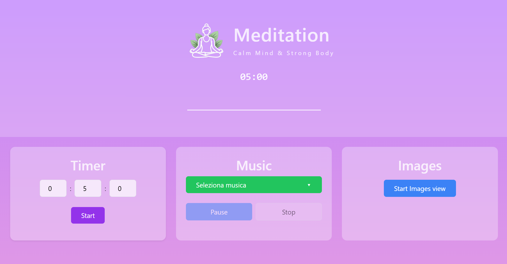

<a id="readme-top"></a>

<!-- PROJECT SHIELDS -->


<!-- PROJECT LOGO -->
<br />
<div align="center">
  <a href="https://antoniods1.github.io/html-meditation-app">
    
  </a>

  <h3 align="center">Meditation App</h3>

  <p align="center">
    A minimalist meditation app focused on relaxation, mindfulness, and focus.
    Built with modern frontend tools, smooth UI interactions, and calming visuals.
    <br />
    <a href="https://antoniods1.github.io/html-meditation-app"><strong>Visit on GitHub Pages »</strong></a>
    <br />
    <a href="https://html-meditation-app.vercel.app"><strong>Visit on Vercel »</strong></a>
    <br /><br />
    <a href="https://github.com/AntonioDS1/html-meditation-app/issues">Report Bug</a>
    ·
    <a href="https://github.com/AntonioDS1/html-meditation-app/issues">Request Feature</a>
  </p>
</div>

---

## 🧘 Overview



**Meditation App** is a modern web application designed to help users relax, focus, and reconnect through guided timers, ambient sounds, and peaceful visuals.

The project focuses on:
- clean UI
- smooth user experience
- modular React architecture
- real-world deploy practices (SEO, PWA, Open Graph)

It is designed as a **portfolio-grade frontend project**, not just a demo.

<p align="right">(<a href="#readme-top">back to top</a>)</p>

---

## 🌿 Core Features

### 🔹 1. Meditation Timer
Customizable meditation sessions with start / stop controls and clean visual feedback.

### 🔹 2. Ambient Sounds
Relaxing soundscapes (rain, ocean, forest, zen) to enhance focus and calm.

### 🔹 3. Minimal & Calming UI
Soft colors, balanced typography, and distraction-free layout.

### 🔹 4. React Component Architecture
Reusable components, lifted state, and clear separation of concerns.

### 🔹 5. Responsive Design
Fully responsive layout for desktop, tablet, and mobile devices.

### 🔹 6. SEO & Social Ready
- Open Graph & Twitter Cards
- Canonical URLs
- Schema.org metadata
- Proper favicon & PWA manifest

### 🔹 7. PWA-Ready
Installable as a web app with standalone mode support.

<p align="right">(<a href="#readme-top">back to top</a>)</p>

---

## 🛠️ Built With

- **React**
- **Vite**
- **JavaScript (ES6+)**
- **HTML5**
- **CSS3**
- **Google Fonts (Nunito)**
- **GitHub Pages** (static deploy)
- **Vercel** (production deploy)

<p align="right">(<a href="#readme-top">back to top</a>)</p>

---

## 🚀 Getting Started

### 1️⃣ Clone the repository

git clone https://github.com/AntonioDS1/html-meditation-app.git

2️⃣ Install dependencies

npm install

3️⃣ Run locally

npm run dev

4️⃣ Build for production

npm run build

<p align="right">(<a href="#readme-top">back to top</a>)</p>

🌐 Live Links

🔹 GitHub Pages

👉 https://antoniods1.github.io/html-meditation-app


🔹 Vercel

👉 https://html-meditation-app.vercel.app


🔹 GitHub Repository

👉 https://github.com/AntonioDS1/html-meditation-app


<p align="right">(<a href="#readme-top">back to top</a>)</p>

📬 Contact

Antonio De Siena


GitHub:

👉 https://github.com/AntonioDS1


Project Links:

👉 GitHub Pages: https://antoniods1.github.io/html-meditation-app

👉 Vercel: https://meditation-app.vercel.app


<p align="right">(<a href="#readme-top">back to top</a>)</p> ```
